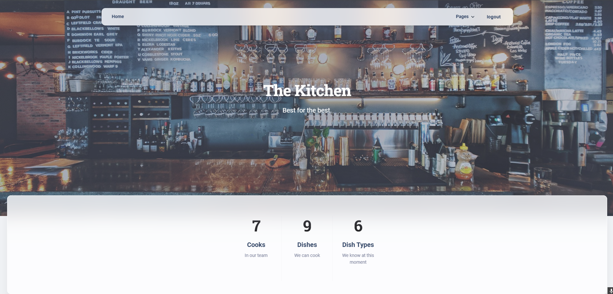

# Kitchen project
A website, created using Django.\
It's Main Goal is to create convenient and simple interface to manage Kitchen.

## Installation
```shell
git clone https://github.com/Atikiho/Kitchen.git
cd Kitchen/
python3 -m venv venv
source venv/bin/activate
pip install -r requirements.txt
python manage.py migrate
python manage.py loaddata ficture.json
python manage.py runserver
```
# Features
- CRUD operations for each Cook, Dish and Dishtype from website
- Authentication functional for user model Cook
- Convenient searching functionality for dishes

# Technologies
- Python
- SQLite3
- Django

# Check it out
>##### Test user
> username: Ratatui\
> password: 1qazcde123
### [Kitchen deployed on render](https://kitchen-1-r75j.onrender.com/)
## Home page demo
